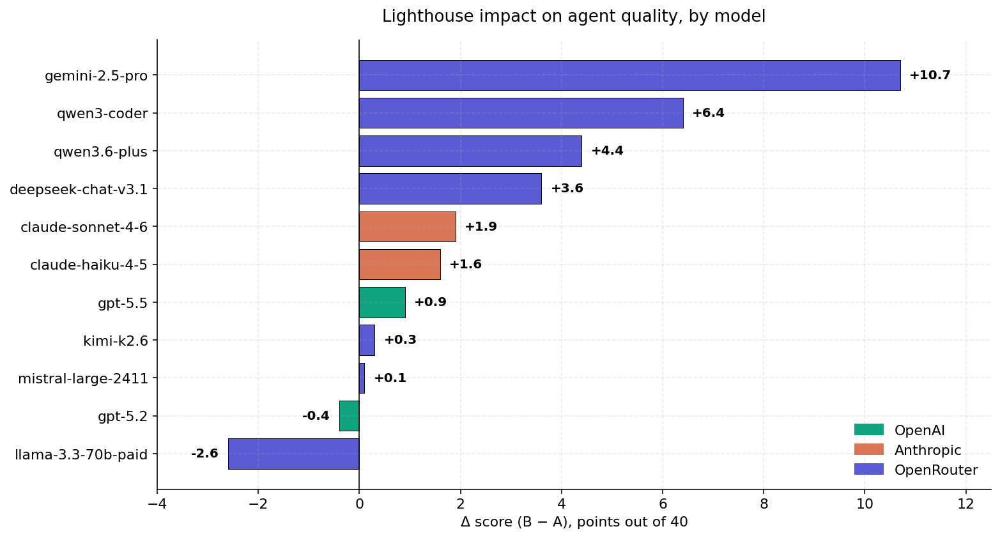
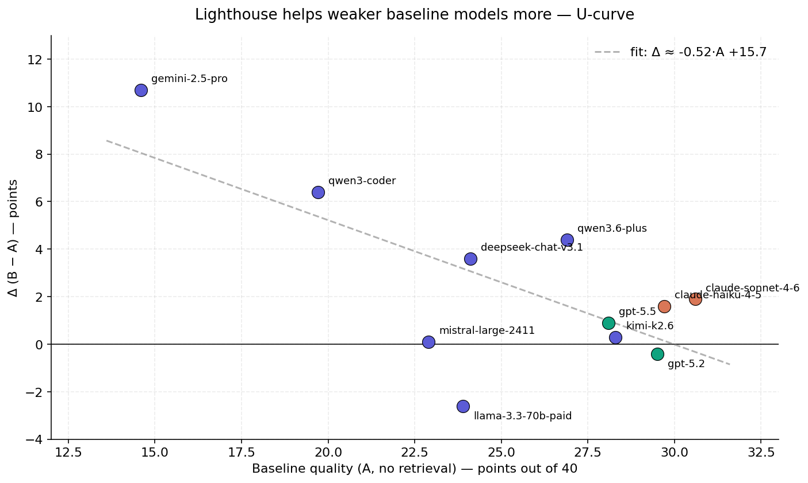
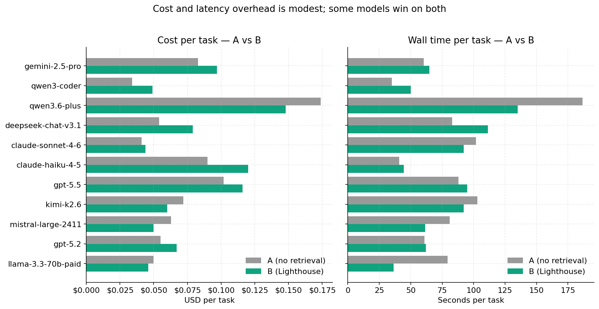
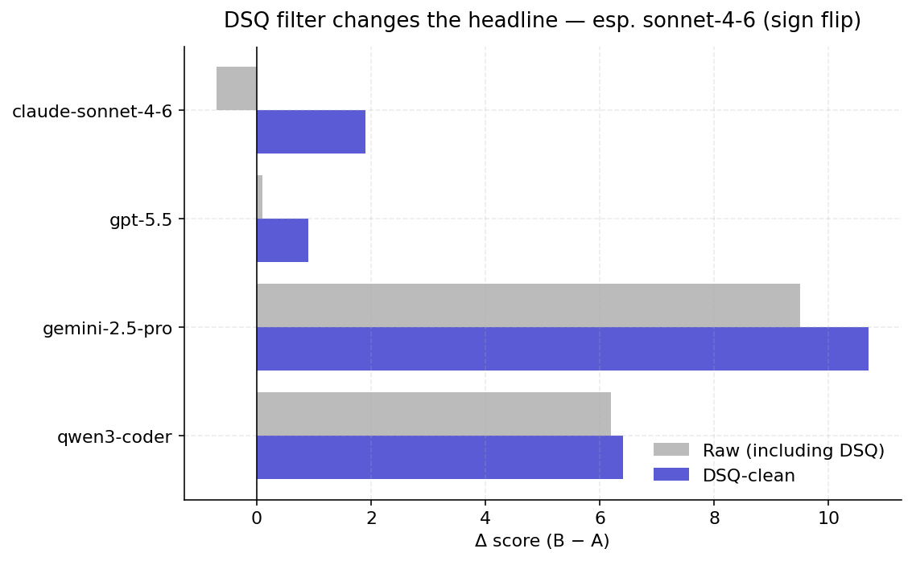
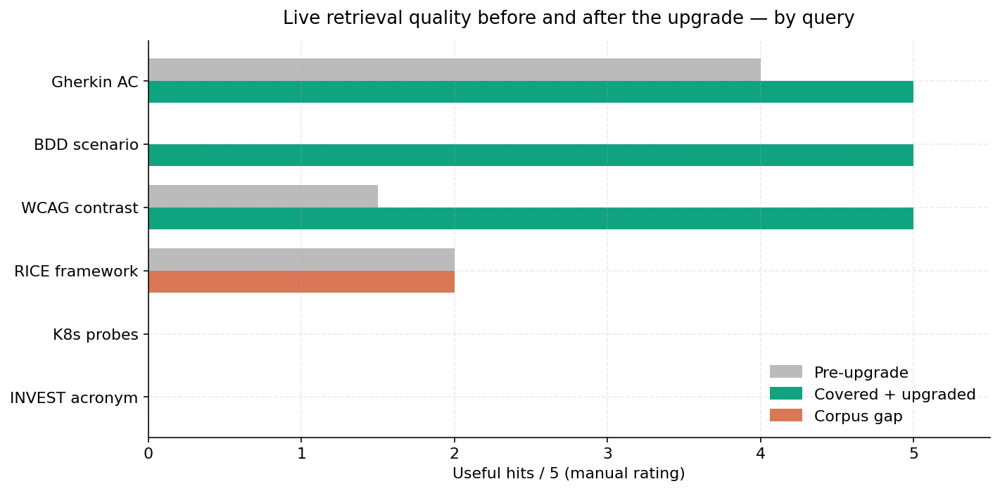

# Does giving AI agents a shared knowledge base actually help?

We built one to find out. Here's what we learned, where it worked, and
where it embarrassingly didn't.

---

## The setup, in one paragraph

Most AI coding agents today are running blind. Either they're stuck
with whatever they remember from training, or they're plugged into a
private codebase that nobody outside the company can see. We built
**Lighthouse** — an open knowledge base that any agent (Claude, GPT,
Gemini, anything that speaks MCP) can ask in plain English: "what's
a good Gherkin acceptance criteria for password reset?", "RICE
prioritization in one line", "how do you write a WCAG-compliant dark
mode?" — and get a structured, ranked answer back.

Then we asked the obvious question: **does it actually help?** We
ran 11 different AI models through 35 software-development tasks
(writing PRDs, splitting user stories, designing tech architectures,
debugging) twice each — once without Lighthouse, once with it — and
let a neutral judge score both answers.

This is what came out.

---

## The headline



Each bar is one AI model. The number is how many quality points
Lighthouse added (or removed) on a 0-40 scale.

- **Seven out of eleven** models got noticeably better.
- **Gemini 2.5-Pro gained +10.7 points** — a quarter of the entire
  score range. Its baseline was the weakest, so it had the most room.
- **Three models tied** — Lighthouse neither helped nor hurt.
- **Llama 3.3-70B got worse** by 2.6 points. The retrieved context
  apparently overwhelms its working memory, and answers degrade.

---

## The pattern: weak models benefit, strong models hit a ceiling



The scatter shows the rule we kept seeing: **the worse a model is on
its own, the more Lighthouse helps it**. The trend line is roughly
"every point of baseline quality eats half a point of Lighthouse lift."

Why? A weak model often doesn't know that the framework you're asking
about is called "RICE" or that the testing pattern is "INVEST". When
the retrieval surfaces those terms, the model gets to do its work on
top of correct vocabulary, and the answer improves. A frontier model
already knows the vocabulary, so the retrieval is at best a small
refinement and at worst noise.

GPT-5.2 sits right at the ceiling — it's the strongest model in the
panel (29.5 baseline) and gets nothing from retrieval (Δ = -0.4).
Claude Sonnet 4.6 is one point above it but does pick up +1.9, which
is the most we saw at the top of the table.

---

## Cost — surprisingly chill



We were braced for "retrieval makes everything 2× more expensive". It
doesn't:

- Average cost increase: **+\$0.014 per task** (~25 % overhead).
- Average latency increase: **+4.4 seconds per task**.

Two pleasant surprises: **Qwen3.6-Plus and Mistral-Large get cheaper
and faster with Lighthouse** — retrieval saves the model from
wandering and the response shortens. This is the rare "free lunch"
that benchmarks sometimes find when you stop measuring only quality.

---

## The trap we almost fell into



The first time we ran the bench, the headline said: "Lighthouse
helps gpt-5.5 by +0.1 points" and "ties dominate at 40 %". That
looked wrong. It was.

Modern "reasoning" models like GPT-5 and Kimi spend most of their
output budget on hidden thinking. With our original token cap, the
visible answer often came back **empty** — and the judge scored two
empty answers as a tie. Roughly 37 % of GPT-5.5's first pass was
"empty vs empty → tie".

We added a filter that throws out those infrastructure failures,
re-ran the broken tasks with a bigger budget, and watched the numbers
shift:

- GPT-5.5 lift: +0.1 → **+0.9** (ties dropped from 40 % to 11 %).
- Claude Sonnet 4.6: **−0.7 → +1.9** — the sign actually flipped.

The lesson: when you benchmark reasoning models, "no answer" is not
the same as "the same answer". Pretending otherwise will make
retrieval look useless when it's actually working.

---

## How well does it work in practice?



We dialed up the live Lighthouse server (the same one any of you can
talk to) and asked it six questions, then counted how many of the top
five hits were actually useful. After the post-bench upgrade:

- **Gherkin / BDD / WCAG questions**: 5/5 hits useful. Real
  improvement.
- **K8s readiness probes, RICE framework, INVEST stories**: still 0
  useful hits — but **the corpus doesn't actually contain those
  topics**.

This is the most honest finding in the whole report. The bench
numbers are real, but they're also **bounded by what we put into the
knowledge base**. We seeded ~285 sources covering Agile, BDD, OWASP,
WCAG, and PM frameworks; we did **not** seed Kubernetes ops or
collaborative-editing patterns or PDF tooling. So when the live tool
gets asked about those, it returns nothing, which is honest but
unhelpful.

---

## What we got wrong, in one list

1. **One judge.** All verdicts came from Claude Sonnet 4.6. A panel
   would be more credible.
2. **Tasks may be biased toward what the corpus covers.** We tried to
   design the suite before configuring the retrieval, but there's no
   way to fully isolate this.
3. **Reasoning budgets need babysitting.** The fix that made
   Sonnet's number flip from −0.7 to +1.9 was a one-line config
   change. That's how fragile the numbers are.
4. **Some models were billed through OpenRouter** (which marks up
   ~5 %) when native APIs were available. Cost numbers are slightly
   above the floor.
5. **Live spot-check is 5 queries.** It's a smell test, not science.
6. **Corpus gaps are real and not closed.** Skipping source expansion
   was a deliberate choice in this iteration; the next one will fix
   the obvious misses (K8s, CRDTs, dev tooling).

---

## What it means, practically

If you're running an agent that **isn't a frontier model** — most
agent stacks are not — adding a knowledge base like Lighthouse is one
of the cheapest quality wins you can make. Gemini-2.5-Pro got +10.7
points for two-cent retrieval. Qwen3-Coder got +6.4. DeepSeek got
+3.6.

If you're already on the strongest model in your provider's catalog,
expect smaller lifts (+1 to +2) or none. The win, then, isn't
quality — it's **shareability**: an open knowledge layer means your
agent team and your colleague's agent team see the same answer to
"what's INVEST?", instead of three different hallucinations.

And: if you measure retrieval gains, **filter out infrastructure
failures first**. Otherwise you'll quietly understate the effect of
the thing you're trying to evaluate.

---

## Try it

The MCP endpoint is live at:

```
https://lighthouse.harborgang.com/mcp/
```

Three tools: ``search(query, top_k)``, ``fetch(node_id)``,
``propose(content, ...)``. Source is at
[github.com/ElMundiUA/lighthouse](https://github.com/ElMundiUA/lighthouse).

— Harbor Gang, 2026-05-15
